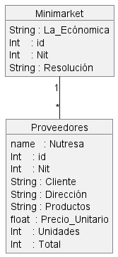

# DIAGRAMA DE OBJETOS UML

#### Através de un diagrama de objeto represente el siguiente enunciado, un supermercado o minimarket, corresponde a un proveedor y un proveedor puede tener muchos supermercados. 

# Diagrama

